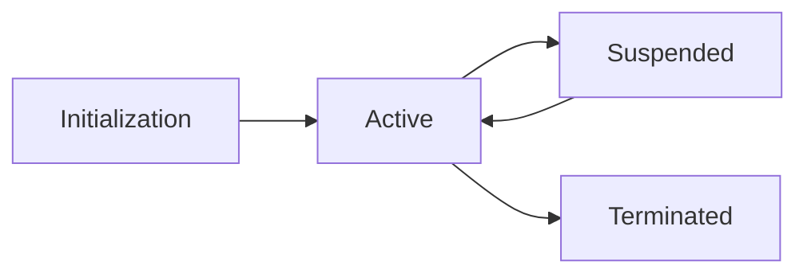

# Agent Lifecycle

Agents in the OpenPango ecosystem progress through distinct lifecycle states.

## States

1. **Initialization**: The agent's soul is loaded and the workspace is prepared.
2. **Active**: The agent is executing tasks and interacting with the environment.
3. **Suspended**: The agent is temporarily paused to conserve resources.
4. **Terminated**: The agent's process has ended; its soul is preserved.

## Diagram



## Management API

You can manage the lifecycle programmatically:

```typescript
import { AgentManager } from 'openpango-core';

const manager = new AgentManager();
await manager.spawn('0xabc'); // Init -> Active
await manager.suspend('0xabc'); // Active -> Suspended
```
